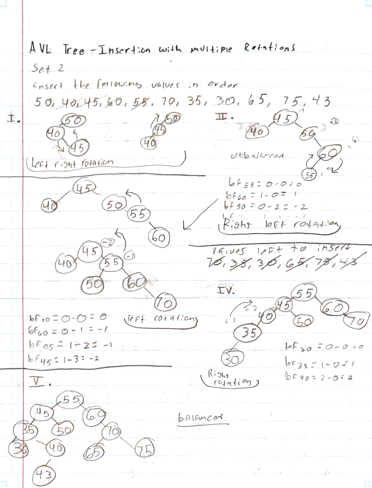
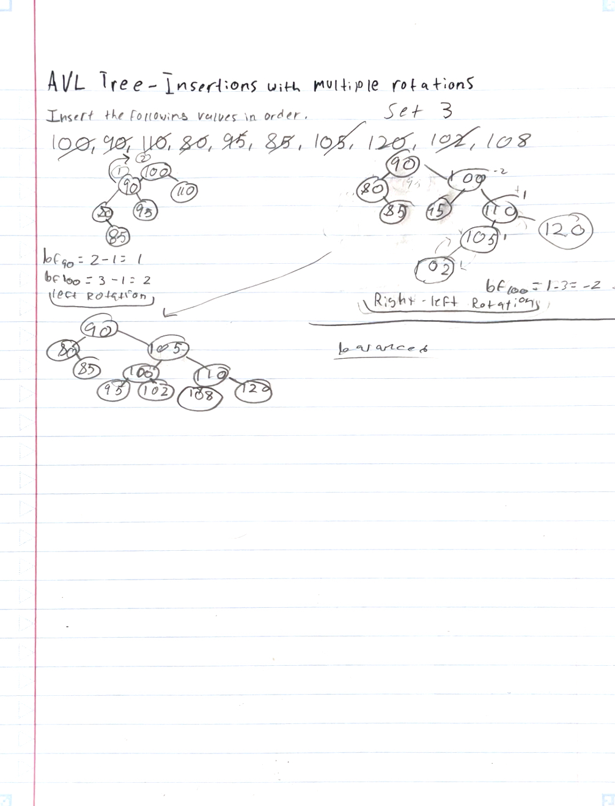

## H01 - AVL Tree
### Jesus Mendoza

### Description:

This assignment requires inserting a sequence of integers into an AVL tree and analyzing how the tree maintains balance through rotations. The process involves identifying where imbalances occur and determining the necessary rotations (LL, RR, LR, RL) to restore balance as values are inserted.

## Set 1

## Set 2

## Set 3

